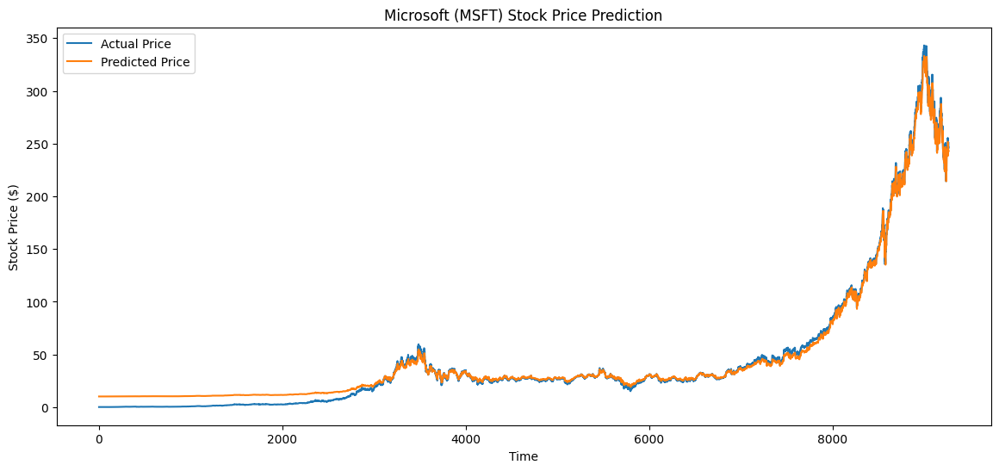

# Microsoft (MSFT) Stock Price Prediction

A machine learning project that predicts Microsoft (MSFT) stock prices using historical market data. The project includes data preprocessing, model training, prediction generation, and visualization of actual versus predicted stock prices.

---

## Overview

This project uses historical Microsoft stock price data to train a machine learning model capable of estimating stock prices based on past market behavior. After training, the model generates predictions which are compared against actual stock prices to evaluate performance.

The project also provides visualizations and exports prediction results to a CSV file for further analysis.

---

## Features

- Historical stock data processing
- Data cleaning and preparation
- Training and testing dataset split
- Stock price prediction using machine learning
- Actual vs Predicted price comparison
- Result visualization using Matplotlib
- Prediction export to CSV

---

## Dataset Files

The project uses the following datasets:

| File | Description |
|--------|------------|
| `MSFT.csv` | Historical Microsoft stock price data |
| `prices.csv.gz` | Historical stock prices dataset |
| `prices-split-adjusted.csv.gz` | Split-adjusted stock prices |
| `securities.csv` | Company information |
| `fundamentals.csv` | Company fundamental data |
| `MSFT_Predictions.csv` | Generated predictions and actual prices |

### Main Columns Used

- Date
- Open
- High
- Low
- Close
- Volume

---

## Project Structure

```text
Microsoft-Stock-Prediction/
│
├── MSFT.csv
├── MSFT_Predictions.csv
├── prices.csv.gz
├── prices-split-adjusted.csv.gz
├── securities.csv
├── fundamentals.csv
│
├── Microsoft_prediction_result.png
├── accuracy(actual_vs_predicted_stock_prices).png
│
├── main.py
├── notebook.ipynb
│
└── README.md
```

---

## Workflow

### 1. Data Loading

Historical Microsoft stock data is loaded from the dataset.

### 2. Data Preprocessing

The dataset is prepared for training by:

- Handling missing values
- Selecting required features
- Formatting data for the model

### 3. Train-Test Split

The data is divided into:

- Training Data
- Testing Data

This allows the model to be evaluated on unseen data.

### 4. Model Training

A machine learning model is trained using historical stock price information.

### 5. Prediction

The trained model generates stock price predictions on the test dataset.

### 6. Evaluation

Predicted values are compared against actual stock prices.

### 7. Visualization

Graphs are generated to show:

- Long-term prediction performance
- Actual vs Predicted prices

---

## Results

### Stock Price Prediction

The chart below compares actual Microsoft stock prices with the model's predictions across the dataset.



---

### Actual vs Predicted Prices

A closer view of the testing period showing how closely the predicted values follow actual stock prices.

.png)

---

## Output

The project generates:

### Prediction CSV

`MSFT_Predictions.csv`

Example:

| Actual Price | Predicted Price |
|-------------|----------------|
| 35.20 | 35.11 |
| 36.45 | 36.32 |
| 37.10 | 36.98 |

---

## Installation

Clone the repository:

```bash
git clone https://github.com/your-username/microsoft-stock-price-prediction.git
```

Move into the project directory:

```bash
cd microsoft-stock-price-prediction
```

Install dependencies:

```bash
pip install pandas numpy matplotlib scikit-learn
```

---

## Usage

### Run Python Script

```bash
python main.py
```

### Run Jupyter Notebook

```bash
jupyter notebook
```

Open the notebook and run all cells.

---

## Libraries Used

- Python
- Pandas
- NumPy
- Matplotlib
- Scikit-learn

---

## Evaluation

The model performance is evaluated by comparing:

- Actual stock prices
- Predicted stock prices

Visual inspection of the generated plots helps assess how closely the model follows market movements.

---

## Limitations

- Predictions are based only on historical price data.
- News, economic events, and market sentiment are not included.
- Future market behavior cannot be guaranteed by the model.
- Results should not be used as financial advice.

---

## Future Improvements

Possible improvements include:

- Adding technical indicators
  - Moving Average (MA)
  - Relative Strength Index (RSI)
  - MACD
- Testing multiple machine learning algorithms
- Hyperparameter tuning
- Including company fundamentals
- Multi-step future forecasting
- Real-time stock data integration

---

## Author

Developed as a machine learning project for stock price prediction using Microsoft (MSFT) historical market data.

---
